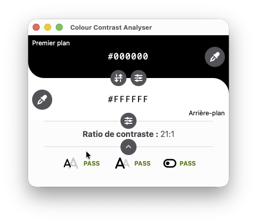

<div align="center">

# Colour Contrast Analyser


**Determine the legibility of text and the contrast of visual elements, such as graphical controls and visual indicators.**

[](https://github.com/WebAccessibilityTools/CCA/releases)
[](LICENSE)
[](https://tauri.app/)
[](https://www.rust-lang.org/)

</div>

---

This repository contains the source code for the new Colour Contrast Analyser (CCA) for Windows and macOS.
It is a full Rust rebuild based on [Tauri](https://tauri.app/).
For the previous Electron version, see the [CCAe](https://github.com/ThePacielloGroup/CCAe) repository.

<div align="center">



</div>

## Table of Contents

- [Features](#features)
- [Installation (macOS)](#installation-macos)
- [Contributing](#contributing)
- [Contact](#contact)
- [License](#license)

## Features

### Beta 1

| Feature | Status |
|---|:---:|
| Accessibility | In progress |
| Native colour picker (Rust) | Done |
| Picker continue mode | Done |
| Internationalisation (i18n) | Done |
| Light/Dark mode | Planned |
| Configurable picker shortcuts | Planned |
| RGB Sliders | Done |
| Copy/Paste format templates | Done |
| Colour name | Planned |

### Beta 2

| Feature | Status |
|---|:---:|
| Alpha colour component | Planned |
| HCL colour values | Planned |
| HSV colour values | Planned |
| LAB colour values | Planned |
| LCHab colour values | Planned |
| CMYK colour values | Planned |
| Free text entry | Planned |
| Windows/macOS installer | Planned |
| Auto-update | Planned |
| Signed certificates | Planned |

### Future

| Feature | Status |
|---|:---:|
| Linux version | Planned |
| Reduced/menubar mode | Planned |
| Colour blindness simulator | Planned |

## Installation (macOS)

> [!NOTE]
> The app is not yet signed with an Apple Developer certificate. You will need to bypass Gatekeeper using one of the options below.

### Option 1 &mdash; Disable Gatekeeper (recommended)

1. Download the latest release from the [Releases](https://github.com/WebAccessibilityTools/CCA/releases) page.
2. Move the unzipped `CCA.app` to your **Applications** folder. **Do not double-click yet.**
3. Open **Terminal** and run:
   ```shell
   sudo spctl --master-disable
   ```
4. Go to **System Settings** > **Privacy & Security** > **Security** and choose **Anywhere**.
5. Double-click `CCA.app` to launch it. Accept the prompt if asked.

### Option 2 &mdash; Without disabling Gatekeeper

1. Download the latest release from the [Releases](https://github.com/WebAccessibilityTools/CCA/releases) page.
2. Enable **System Settings** > **Privacy & Security** > **Security** > **App Store and identified developers**.
3. Double-click `CCA.app`. It will be blocked. Go to **System Settings** > **Privacy & Security** > **Security** and click **Open Anyway**.
4. If prompted, allow the application to run.

### Option 3 &mdash; Remove quarantine for CCA only

1. Download the latest release from the [Releases](https://github.com/WebAccessibilityTools/CCA/releases) page.
2. Move the unzipped `CCA.app` to your **Applications** folder. **Do not double-click yet.**
3. Open **Terminal** and run:
   ```shell
   sudo xattr -cr ~/Applications/CCA.app
   ```

## Contributing

If you have an idea for a new feature or found a bug, please [open an issue](https://github.com/WebAccessibilityTools/CCA/issues). Search existing issues first to prevent duplicates.

Pull requests are welcome! Please follow the [Contribution Guidelines](CONTRIBUTING.md) before submitting.

## Contact

If you have any questions, feel free to [open an issue](https://github.com/WebAccessibilityTools/CCA/issues) here on GitHub.

## License

[](http://www.gnu.org/licenses/gpl-3.0.en.html)

Colour Contrast Analyser (CCA) is Free Software: you can use, study, share and improve it at your will. Specifically you can redistribute and/or modify it under the terms of the [GNU General Public License](https://www.gnu.org/licenses/gpl.html) as published by the Free Software Foundation, either version 3 of the License, or (at your option) any later version.

> This program is distributed in the hope that it will be useful, but **WITHOUT ANY WARRANTY**; without even the implied warranty of **MERCHANTABILITY** or **FITNESS FOR A PARTICULAR PURPOSE**. See the [GNU General Public License](https://www.gnu.org/licenses/gpl.html) for more details.
